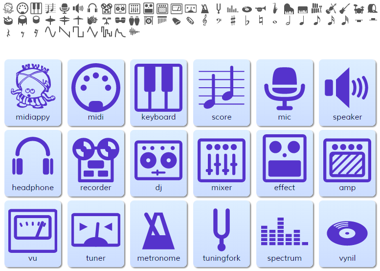

# webmusic-icons

## Overview
**webmusic-icons** is a icon-set of PolymerElements/iron-iconset-svg for Web Music Applications.

## Demo Page
Demo Page is available at :
[Demo page](https://WebMusicDevelopersJP.github.io/webmusic-icons/)

## License

  
   
  To the extent possible under law,
  <a rel="dct:publisher"
     href="http://www.g200kg.com/">
    g200kg</a>
  has waived all copyright and related or neighboring rights to
  webmusic-icons.
This work is published from:

  Japan.

---
